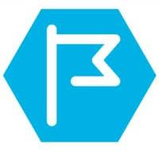

# Welcome to appvey cli tool 

**appvey**  Works seamlessly with Appveyor CI/CD from the command line, helping users to maintain appveyor projects, run builds and download artifacts using [Appveyor REST API](https://www.appveyor.com/docs/api/).

-----

[](https://ci.appveyor.com/project/moh-hassan/appvey)

----------
Download development version from [myget](https://www.myget.org/feed/appvey/package/nuget/Appvey/1.0.0-beta5) 

-----------
**Features of appvey**
- Download build artifacts either all or specific file(s) by version or job id. Artifacts can be:
   - Generated by last build or by any version in a project.
   - Downloaded to a specific folder. 
	- Can be filtered using wildcards or part of file name. 
  - Multiple filters can be applied.
  - Can be listed only without download
  - Show file name with url and file size.

- Implement Builds Rest APIs:
  - Start build of branch most recent commit
  - Start build of specific branch commit
  - Re-run build
  - Start build of Pull Request
  - Cancel build
  - Delete build
- Implement Projects  Rest APIs:
  - Get projects
  - Get project last build
  - Get project last branch build
  - Get project build by version
  - Get project history
  - Get project deployments
  - Get project settings
  - Get project settings in YAML
  - Get project environment variables
  - Add project
  - Update project
  - Update project settings in YAML
  - Update project environment variables
  - Update project build number
  - Delete project build cache
  - Delete project
  
- support reading appveyor token from keyboard, external file, environment variables or piping the token.
- Display result in a tabular form.
- Show summary of response of important information.
- Allow deleting the Cancelled or failed builds in history command which is confirmed by the user.
- Allow Cancel of build when start and confirmed by the user.
- start build and show the build page in the default browser.
- Configure the tool to auto login to Appveyor Ci.
- The login information are common for all commands.
- Using response file (one or more) which contain options and arguments or the value of any option like token. The response file argument start with '@'.
- Save the output response json to external files.
- Save the screen output to external file.
- Support Control-C to stop program with grace stop.
----------

## Install and Usage

## appvey global Console Cli (net8.0)

 Install from nuget gallery, run the command:
```
dotnet tool install --global appvey
```

 Install development version from myget, run the command:
```
dotnet tool install  Appvey --global --add-source https://www.myget.org/F/appvey/api/v3/index.json --prerelease   
```

### How to use:
Run the commands as described in [wiki pages](https://github.com/moh-hassan/appvey/wiki):

	   
#### For help:
- type: `appvey build -?` to show all available build commands.

- Type `appvey project -?` to show all available commands of projects

- Type `appvey build start -?` to show all available commands of build start.

- Type `appvey build download -?` to show all available commands of build download.

Note: help can be displayed by any of: -? or -h or --help


------
 ## Documentation

Read the:[Wiki](https://github.com/moh-hassan/appvey/wiki)

-------
**License**

MIT License. Read [license](https://github.com/moh-hassan/appvey?tab=MIT-1-ov-file#readme)

----------
## Release Notes

[Changes](https://github.com/moh-hassan/appvey/blob/main/ReleaseNotes.md)

## Privacy Policy
All programs or packages will not transfer any information to other networked systems unless specifically requested by the user or the person installing or operating it. 

## Acknowledgements: 

**Thank you [JetBrains](https://www.jetbrains.com "JetBrain") for [Resharper](https://www.jetbrains.com/resharper/ "Resharper") open source license**


**Thank you [SignPath](https://signpath.io?utm_source=foundation&utm_medium=github&utm_campaign=odata2poco) for free code signing.**

